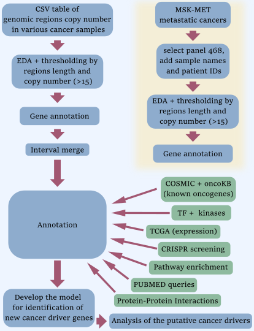
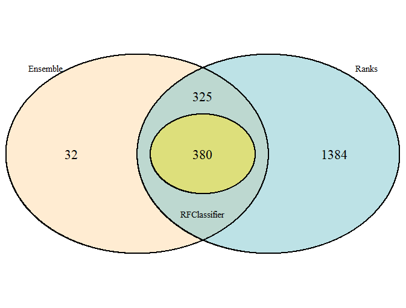

# Identification of new cancer driver genes and associated cellular pathways in high-level amplification regions of genome
The project is done by Iurii Slepov and Yulia Volkova.
 
 
Project supervisor: Andrey Yurchenko, PhD.
## Background
Extrachromosomal DNA (ecDNA) is circular DNA outside of chromosomes. It has been often found in different types of cancers. Many known oncogenes reside within ecDNA. Moreover, ecDNA is often present in high copy number in tumor cells and increased expression of genes located in the ecDNA is observed. Maintaining many copies shows that this feature states under positive selection. We use high-amplification regions from different cancer types samples to estimate how many regions have known oncogenes and search for new oncogenes in the regions where no known oncogenes are present.
## Goal
Identify novel cancer drivers and progression genes located in the regions of genome with high-level amplifications.
## Methods and Pipeline
Two datasets were used for the study: ASCAT copy number profiles for WES TCGA Pan-Cancer dataset containing data of 9699 patients [1] and copy number profiles for targeted DNA sequencing using gene panel IMPACT-468 containing data of 17602 patients with primary and metastatic cancer [2]. Genes located in the high-level amplification regions were annotated as presented in the pipeline.
 
 

 
 
Three approaches have been used for the identification of putative cancer driver genes:
1) *System of ranks:* all features characterizing genes were ranked for each region and genes with a total rank above the ninth decile were selected as potential oncogenes
2) *RandomForestClassifier:* all ranks were normalized within each region and divided into two datasets: a dataset containing regions with known oncogenes (to train the model), and a dataset containing regions without known oncogenes (to apply the model for potential novel oncogenes prediction). Genes with a probability of being oncogenes greater than or equal to 0.9 were selected as potential cancer driver genes. 
3) *Ensemble:* consists of RandomForestClassifier, ExtraTreesClassifier, CatBoostClassifier, XGBRFClassifier and GaussianNB. Data were prepared the same way as for RandomForestClassifier. A cutoff of 0.9 was applied the same way.
## Results
- Revealed that around 20% of cancer samples within cancer type had at least one high-amplification region (and they were present more often in metastatic samples vs primary cancers)
- Found that more than half of high-amplification regions do not contain known oncogenes
- Showed that high-level amplification regions are enriched with oncogenes
- Investigated relevant features to find novel putative oncogenes in high-level amplification regions
- Built models and identified genes candidates that may be rare genetic drivers of cancer progression

Full lists of predicted oncogenes can be found in Data/Result_data folder.
## Bibliography
1. Steele, C.D., Abbasi, A., Islam, S.M.A. et al. Signatures of copy number alterations in human cancer. Nature 606, 984–991 (2022).
2. Nguyen, B., Fong, C., Luthra, A. et al. (2022). Genomic characterization of metastatic patterns from prospective clinical sequencing of 25,000 patients. Cell, 185(3), 563–575.e11. 
